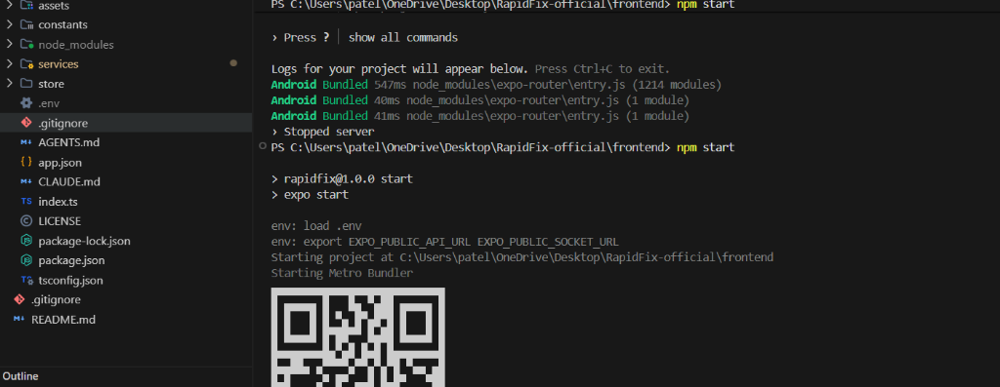
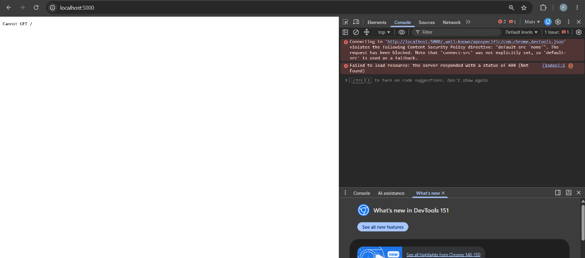
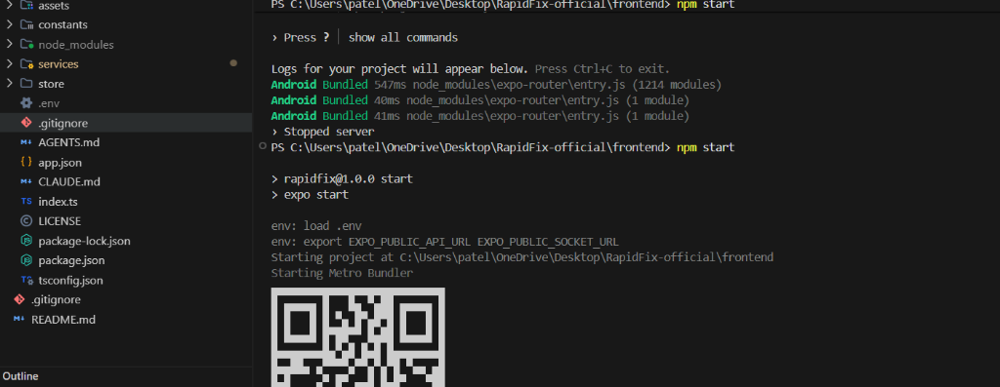
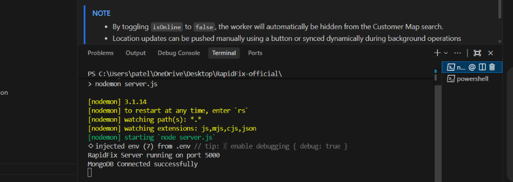

<div align="center">

<!-- Animated Header Banner -->


<!-- Badges Row -->
<p>
  
  
  
  
  
  
</p>

<p>
  
  
  
  
</p>

<br/>

> **RapidFix** is a full-stack, location-based, on-demand service marketplace that connects customers with verified nearby skilled professionals in real-time — like **Urban Company**, built from scratch.

<br/>

</div>

---

## 📱 App Screenshots

<div align="center">

<table>
  <tr>
    <td align="center">
      
      <br/><b>🏠 Customer Dashboard</b>
      <br/><sub>Browse all service categories</sub>
    </td>
    <td align="center">
      
      <br/><b>🗺️ Live Pro Map</b>
      <br/><sub>Real-time GPS tracking of pros</sub>
    </td>
  </tr>
  <tr>
    <td align="center">
      
      <br/><b>📊 Admin Overview</b>
      <br/><sub>Platform metrics & revenue</sub>
    </td>
    <td align="center">
      
      <br/><b>👥 Admin User Directory</b>
      <br/><sub>Manage professionals & customers</sub>
    </td>
  </tr>
</table>

</div>

---

## ✨ Key Features

<div align="center">

| Feature | Description |
|---|---|
| 🗺️ **Live Pro Map** | Real-time GPS map showing all online professionals with category filters |
| ⚡ **Instant Booking** | One-tap service booking with live status updates via Socket.io |
| 🔐 **Role-based Auth** | Separate flows for Customer, Professional & Admin with JWT |
| 🛡️ **Admin Approval** | Professionals must be verified by admin before going live |
| 💬 **In-App Chat** | Real-time private chat between customer and their hired pro |
| ⭐ **Reviews & Ratings** | Star ratings and text reviews after job completion |
| 💰 **Earnings Tracker** | Professionals can track earnings & transaction history |
| 🚨 **Emergency Mode** | Instant high-priority booking for urgent repair needs |
| 📍 **Smart Location** | Auto-detect customer location and nearby pros within 50km |
| 🔔 **Push Notifications** | Real-time job alerts via Socket.io events |

</div>

---

## 🏗️ Architecture

```
RapidFix/
├── 📱 frontend/                  # React Native + Expo (TypeScript)
│   ├── app/
│   │   ├── (auth)/               # Login & Registration screens
│   │   ├── (customer)/           # Customer: Home, Map, Bookings, Profile
│   │   ├── (worker)/             # Pro: Dashboard, Requests, Earnings
│   │   └── (admin)/              # Admin: Stats, Users, Jobs
│   ├── services/                 # API client & Socket.io service
│   ├── store/                    # Zustand global auth state
│   └── constants/                # Theme tokens (colors, shadows, sizes)
│
└── 🖥️ backend/                   # Node.js + Express
    ├── controllers/              # Business logic per role
    ├── routes/                   # REST API routes
    ├── models/                   # Mongoose schemas
    ├── middleware/               # Auth guard, error handler
    └── server.js                 # Express + Socket.io server
```

---

## 🛠️ Tech Stack

<div align="center">

### Frontend
| Technology | Purpose |
|---|---|
| React Native + Expo SDK 54 | Cross-platform mobile app |
| TypeScript | Type-safe development |
| Expo Router (file-based) | Navigation & routing |
| React Native Maps | Google Maps integration |
| Socket.io Client | Real-time event handling |
| Zustand | Global state management |
| Expo SecureStore | Encrypted token storage |
| Expo Location | GPS tracking |

### Backend
| Technology | Purpose |
|---|---|
| Node.js + Express | REST API server |
| MongoDB + Mongoose | Database & schemas |
| Socket.io | Real-time bidirectional events |
| JWT + bcrypt | Authentication & password security |
| GeoJSON / `$near` | Location-based worker queries |

</div>

---

## 👥 User Roles

### 🛒 Customer
- Register / Login
- Browse 9 service categories
- View live map of online professionals
- Book a service with description, address & budget
- Real-time job status tracking
- In-app chat with assigned professional
- Rate & review completed jobs

### 🔧 Professional
- Register with trade category (Plumber, Electrician, etc.)
- **Admin must approve account** before going live
- Toggle Work Mode (Online/Offline) with GPS broadcasting
- Toggle Available for Jobs
- Accept / Reject incoming job requests
- Complete jobs and view earnings history

### ⚙️ Admin
- Platform metrics dashboard (customers, pros, jobs, revenue)
- User directory with filter tabs (All / Pending / Pros / Customers)
- **Approve or Revoke** professional accounts
- Ban / Unban any user account
- Full user details: reviews received, reviews given, job history
- Job monitor with live status view

---

## 🚀 Getting Started

### Prerequisites
```bash
Node.js v18+
MongoDB (local or Atlas URI)
Expo Go app on your phone
```

### 1️⃣ Clone the Repository
```bash
git clone https://github.com/Purnansh29/RapidFix.git
cd RapidFix
```

### 2️⃣ Backend Setup
```bash
cd backend
npm install
```

Create a `.env` file:
```env
PORT=5000
MONGO_URI=your_mongodb_connection_string
JWT_SECRET=your_super_secret_key
```

Start the server:
```bash
npm run dev
```

### 3️⃣ Frontend Setup
```bash
cd frontend
npm install
```

Create a `.env` file:
```env
EXPO_PUBLIC_API_URL=http://YOUR_LOCAL_IP:5000/api
EXPO_PUBLIC_SOCKET_URL=http://YOUR_LOCAL_IP:5000
```

Start Expo:
```bash
npm start
```
> Scan the QR code with Expo Go on your phone, or run on an emulator.

---

## 🔑 Admin Credentials

```
Email:    admin@rapidfix.com
Password: adminpassword
```

---

## 🔄 Real-Time Events (Socket.io)

| Event | Direction | Description |
|---|---|---|
| `job:newRequest` | Server → Pro | New booking received |
| `job:statusUpdated` | Server → Customer | Job accepted / completed |
| `worker:statusUpdated` | Server → All Customers | Pro goes online/offline |
| `worker:updateLocation` | Pro → Server | GPS coordinate update |
| `chat:sendMessage` | Bidirectional | In-app messaging |

---

## 📄 License

This project is licensed under the **MIT License**.

---

<div align="center">

<!-- Animated Footer -->


<p>
  Built with ❤️ by <strong>Purnansh Patel</strong>
  <br/>
  <a href="https://github.com/Purnansh29">GitHub</a> •
  <a href="https://github.com/Purnansh29/RapidFix">Repository</a>
</p>


</div>

